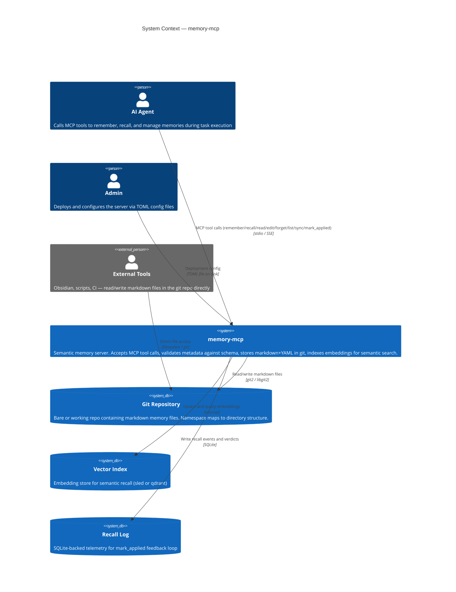
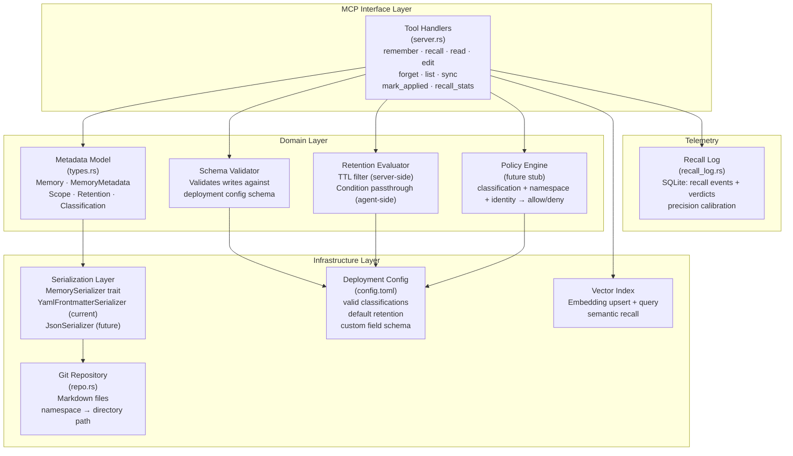
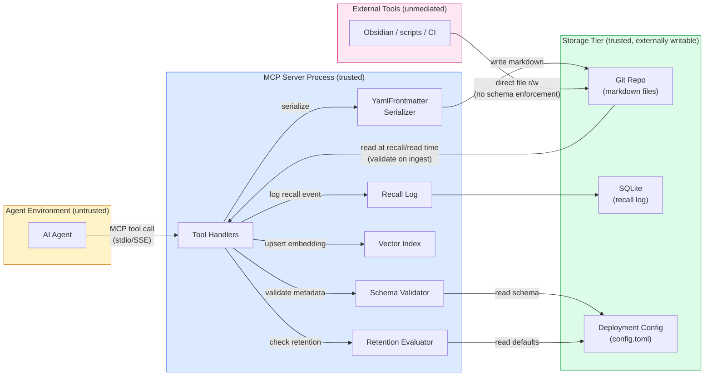
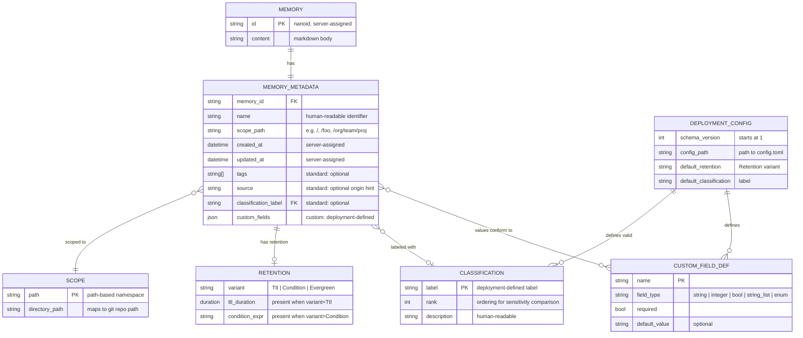
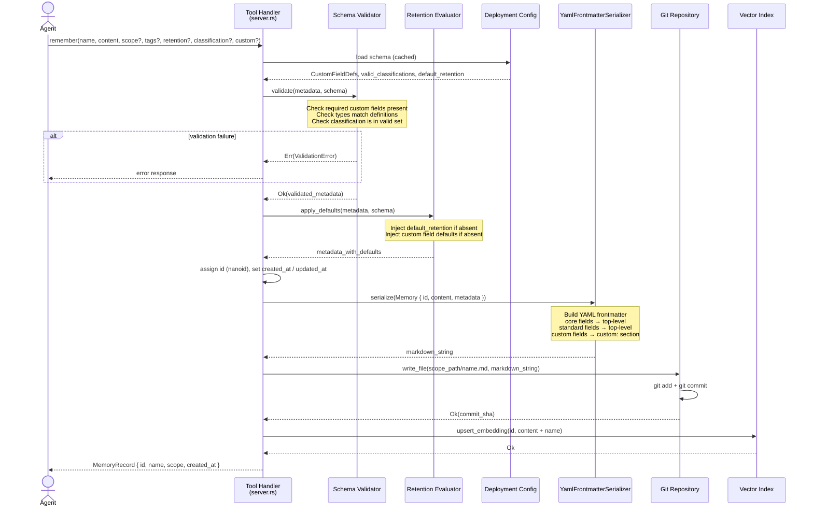

<!-- design-meta
status: approved
last-updated: 2026-05-25
phase: 3
-->

# Architecture: Memory Metadata Framework

This document captures the architecture of the memory-mcp metadata framework redesign through a set of Mermaid diagrams. Each diagram targets a distinct architectural concern: system boundaries, internal structure, data flow with trust zones, the metadata schema, and the key write path.

---

### System Context

Memory-mcp sits at the center of a three-actor system: AI agents drive the primary read/write workload via MCP tools, admins shape behavior through deployment config, and external tools access the underlying git repository directly. The MCP server mediates all structured access, while the git repo serves as the shared persistence layer that external tooling can reach without going through the server.



---

### Component Diagram

The server is organized into four layers: the MCP interface (tool handlers), the domain model (types and validation), the infrastructure adapters (serialization, storage, indexing), and the telemetry subsystem. Each component has a narrow interface; the schema validator and serialization adapter are the main extension points for the new metadata design.



---

### Data Flow with Trust Boundaries

Three trust zones are in play: the agent environment (untrusted input), the mcp server process (trusted execution), and the storage tier (trusted but externally writable). The critical boundary crossing is the agent→server interface, where all inputs are validated against the schema config before any write reaches storage. The git→external path is unmediated, so schema invariants on externally-written files are only enforced at read time.



---

### Data Schema

The metadata model is organized around a central `Memory` entity that composes a `MemoryMetadata` record. Metadata splits cleanly into three tiers — core (server-managed), standard (well-known optional), and custom (deployment-defined) — with `Scope`, `Retention`, and `Classification` as first-class value types. `DeploymentConfig` is the compile-time-external schema that governs validation and defaults; it is referenced by the server at startup, not embedded in individual memory records.



---

### Sequence: `remember` Tool Call

The `remember` flow is the primary write path and exercises all new framework components in order: schema validation (including default injection), retention evaluation, serialization to YAML frontmatter, git commit, and embedding upsert. Schema validation is a hard gate — any unknown field or type mismatch returns an error before touching storage. Default injection runs only on validated records, filling in absent optional fields from the deployment config.



---

### Observability: OpenTelemetry Spans

All new components emit OTel spans. This is table stakes — the existing tracing scaffold (see [tracing design](../tracing/)) established the pattern; the metadata framework extends it.

#### Spans per component

| Component | Span name | Key attributes | Emitted on |
|-----------|-----------|----------------|------------|
| Schema Validator | `schema.validate` | `field_count`, `custom_field_count`, `result` (ok/error), `error_reason` | `remember`, `edit` |
| Retention Evaluator | `retention.evaluate` | `variant` (ttl/condition/evergreen), `result` (fresh/expired/passthrough), `memories_filtered` | `recall`, `read`, `list` |
| MemorySerializer | `serialize` | `format` (yaml_frontmatter), `total_fields`, `custom_fields` | `remember`, `edit` |
| MemorySerializer | `deserialize` | `format`, `had_unknown_fields`, `applied_defaults` | `read`, `recall`, `list`, startup ingest |
| Ingest Validator | `ingest.validate` | `files_scanned`, `files_passed`, `files_skipped`, `skip_reasons` | startup, read |
| Classification Filter | `classification.filter` | `filter_applied`, `memories_excluded`, `classification_level` | `recall` |
| Audit Logger | `audit.write` | `operation`, `commit_sha`, `classification_change` (if any), `source` | `remember`, `edit`, `forget` |
| Retention Reaper | `retention.reap` | `expired_count`, `deleted_count`, `errors` | background/lazy cleanup |

#### Span hierarchy

Tool handler spans (already exist) become parents:
```
remember (existing)
  └── schema.validate
  └── retention.evaluate (apply defaults)
  └── serialize
  └── repo.write (existing)
  └── index.upsert (existing)
  └── audit.write

recall (existing)
  └── index.query (existing)
  └── deserialize (per result)
  └── retention.evaluate (per result)
  └── classification.filter
```

#### Error attributes

All spans record `otel.status_code` = `ERROR` on failure with `error.type` and `error.message`. Schema validation errors include the specific field and constraint that failed. Ingest validation errors include the file path and parse error.

---

### Implementation Notes

#### MemorySerializer: trait object, not generic

The serializer is stored as `Arc<dyn MemorySerializer + Send + Sync>` for runtime backend selection. Not generic — we expect few implementations and runtime config determines the serializer.

#### Re-embedding rules

| Change | Re-embed? | Rationale |
|--------|-----------|-----------|
| Content modified | Yes | Content participates in embedding |
| Name changed | Yes | Name participates in embedding text |
| Scope/classification/retention changed | No | Metadata-only, not in embedding text |
| Tags/source changed | No | Not included in embedding input |
| Custom fields changed | No | Not included in embedding input |

This must be enforced as a documented invariant and tested. Accidental re-embedding on metadata-only changes degrades recall quality silently.

#### Defaults: virtual, not materialized

When reading a memory that lacks retention, classification, or custom field values, the server returns the deployment defaults in the response but does **not** rewrite the frontmatter file. Materialization only occurs on explicit `edit`. This prevents silent file modification that would confuse external tools (Obsidian) and create noisy git diffs.

#### Classification: single-label, ordered

Each memory has exactly one classification label, not a list. The deployment config defines labels with explicit rank ordering. Recall filtering compares ranks: "exclude memories with rank above N." This avoids the multi-label taxonomy trap.

```toml
schema_version = 1

[classification]
default = "internal"

[[classification.labels]]
name = "public"
rank = 10

[[classification.labels]]
name = "internal"
rank = 20

[[classification.labels]]
name = "confidential"
rank = 30

[[classification.labels]]
name = "restricted"
rank = 40
```

#### Unknown field preservation (four-bucket model)

On deserialization, frontmatter fields are classified into four buckets:
1. **Core fields** — server-managed, always present
2. **Standard fields** — well-known optional (tags, source, retention, classification)
3. **Schema-known custom fields** — validated against deployment config
4. **Unknown legacy fields** — preserved on round-trip but not accepted in new writes

Bucket 4 enables backward compatibility: old memories with pre-framework fields are preserved, but new `remember` calls cannot introduce arbitrary unknown fields outside the `custom:` section.
