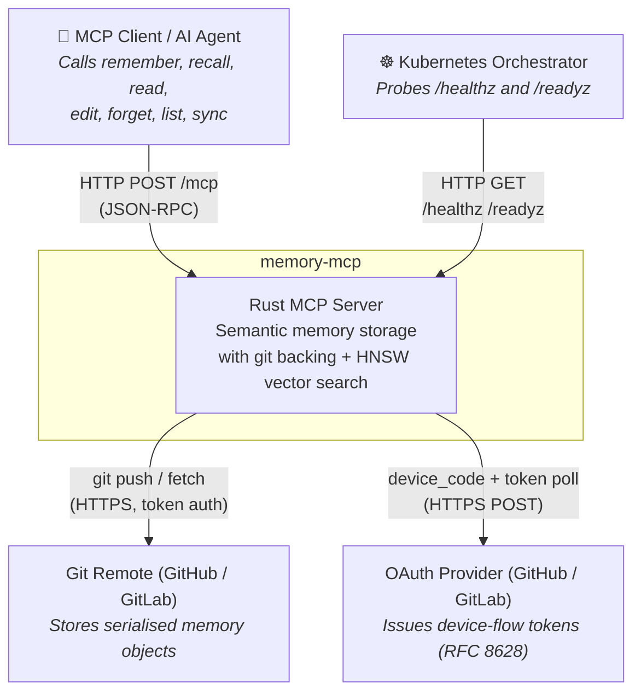
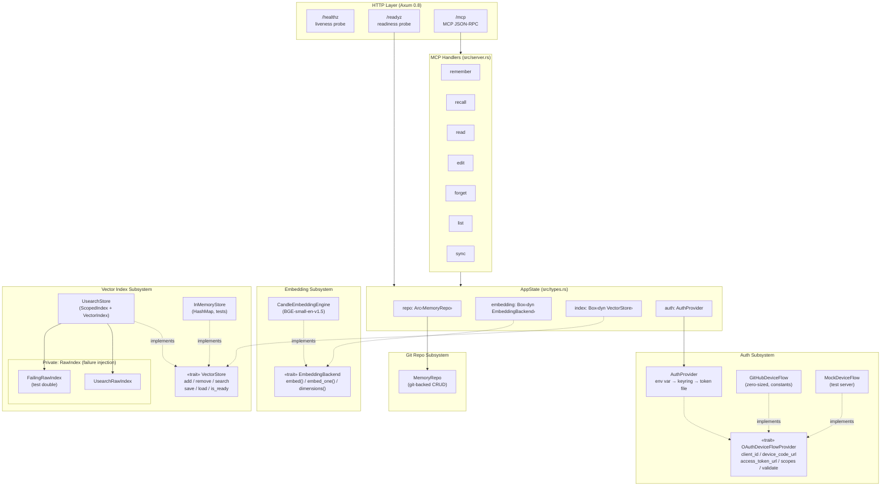
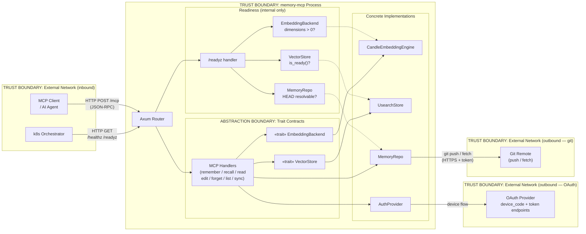
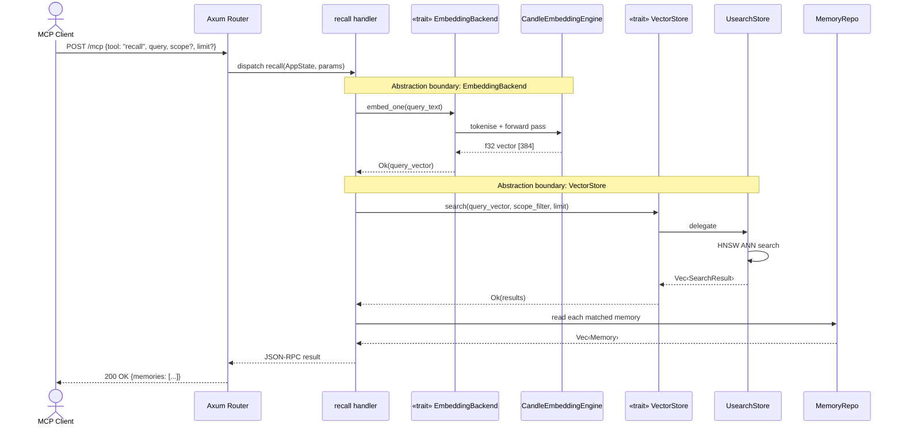
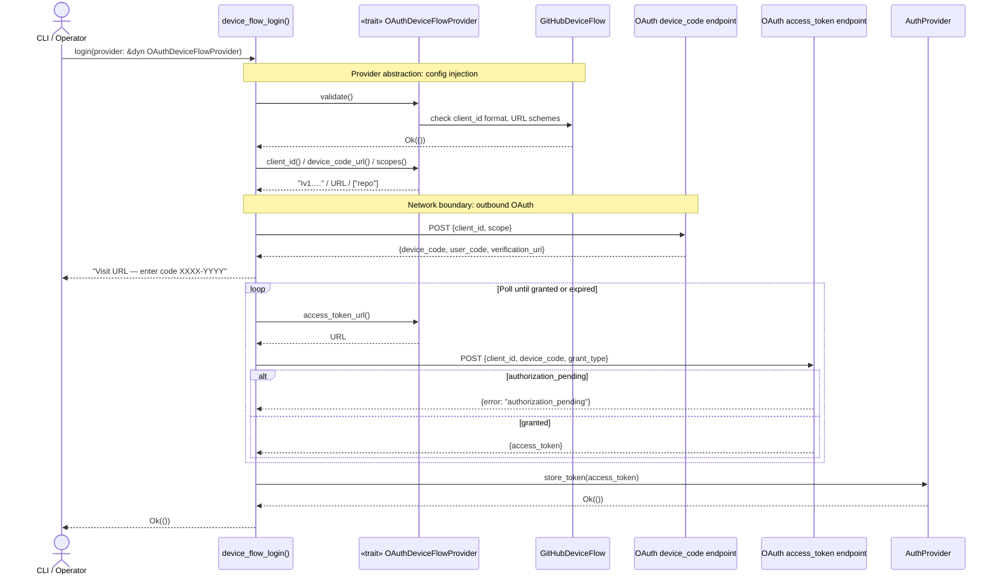
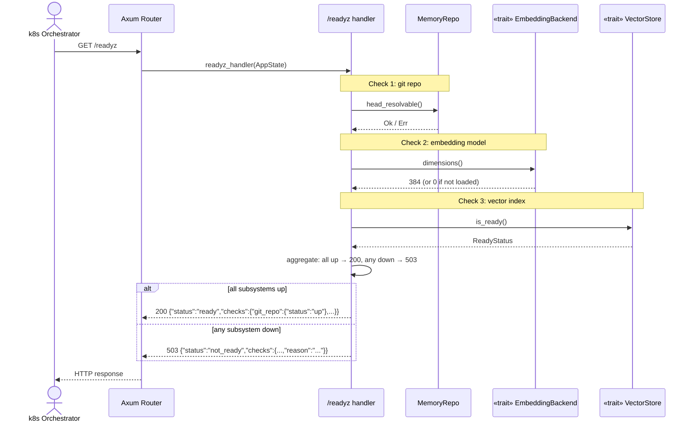

<!-- design-meta
status: draft
last-updated: 2026-04-25
phase: 3
-->

# Architecture — Phase 2 Quality: Config, Testability, Index Abstraction & Health

Issues: #94, #145, #146, #164

## Architectural Decisions

### 1. VectorStore trait (public, semantic-level)

`AppState.index` changes from `ScopedIndex` to `Box<dyn VectorStore>`. The trait
defines what the rest of the system needs from vector storage — add, remove, search
by name and scope, persist, report health. This matches the existing pattern where
`AppState.embedding` is already `Box<dyn EmbeddingBackend>`.

**Dynamic dispatch** (`Box<dyn>`) rather than generics on `AppState`. This avoids
generic parameter proliferation through the server stack and keeps the trait
object-safe.

Implementations:
- **`UsearchStore`** — wraps existing `ScopedIndex`/`VectorIndex` logic. Internally
  uses a private `RawIndex` trait for failure injection in tests.
- **`InMemoryStore`** — `HashMap`-based, for fast deterministic tests at the trait
  level.

### 2. OAuthDeviceFlowProvider trait (RFC 8628)

The hardcoded GitHub OAuth constants become a trait covering the RFC 8628 device
authorization grant specifically. See [ADR-0024](../../../docs/adr/0024-oauth-device-flow-provider-trait.md)
for the full analysis of why this is scoped to device flow, not all OAuth.

`device_flow_login()` takes `&dyn OAuthDeviceFlowProvider` instead of importing
constants directly.

Implementations:
- **`GitHubDeviceFlow`** — zero-sized struct, compile-time constants.
- **`MockDeviceFlow`** — points at an in-process test server for integration tests.

### 3. /readyz endpoint

A new Axum route alongside `/healthz`. Checks three subsystems via their existing
APIs — no new network calls, no heavy computation:
- Git repo: HEAD resolvable
- Embedding: `dimensions() > 0`
- Vector index: `is_ready()` from VectorStore trait

Returns 200 + JSON or 503 + JSON with per-subsystem status. Response bodies use a
fixed vocabulary (`"up"` / `"down"` + a constrained `reason` field on failure) —
no internal paths, versions, or stack traces.

No auth required — this is an infrastructure endpoint, same as `/healthz`.

### 4. Integration test architecture

In-process mock OAuth server (small Axum app started per test) implementing the
device code and token endpoints. All tests use ephemeral ports to avoid conflicts
in parallel runs.

Tests are `#[tokio::test]`, calling the same entry points with injected config
rather than spawning the binary.

## Diagrams

### System Context

memory-mcp sits between four external relationships: AI agents drive it over
HTTP/MCP, a Kubernetes orchestrator probes its health endpoints, a git remote
backs its storage, and an OAuth provider handles credential issuance. All network
traffic crosses a single ingress point (the Axum router), and the git and OAuth
relationships are outbound-only.

### Component Diagram

Internal structure after the Phase 2 refactor, wired through `AppState`. Three
trait-abstracted subsystems: `EmbeddingBackend` (existing), `VectorStore` (new),
and `OAuthDeviceFlowProvider` (new). The `/readyz` endpoint reaches into all three
subsystems to assert readiness. The private `RawIndex` trait inside `UsearchStore`
is shown separately — it exists only for failure injection testing.

### Data Flow Diagram with Trust Boundaries

Three network trust boundaries: external HTTP ingress, outbound OAuth, and outbound
git. Inside the server, the abstraction boundary between MCP handlers and
`VectorStore` is a design seam (not a security boundary) that enables test
substitution. The `/readyz` handler is entirely within the server boundary — no
external calls, only introspecting subsystem state through trait methods.

### Sequence: Memory Recall Flow

The full path of a `recall` call, making the trait boundary explicit: the handler
calls methods on `VectorStore`, never on `UsearchStore` directly. The embedding
step is a separate round-trip through `EmbeddingBackend` before vector search.

### Sequence: Device Flow Login

The `OAuthDeviceFlowProvider` abstraction insulates login orchestration from
hardcoded constants. `GitHubDeviceFlow` supplies all endpoint URLs and scopes.
`MockDeviceFlow` can substitute in integration tests by pointing at a local test
server without any change to the flow driver.

### Sequence: Readiness Check

`/readyz` is entirely inward-facing: every check is a method call on an
already-initialised subsystem. No network I/O occurs. The handler aggregates
per-subsystem status into structured JSON and returns 503 if any check fails,
200 if all pass, without exposing internal details.

