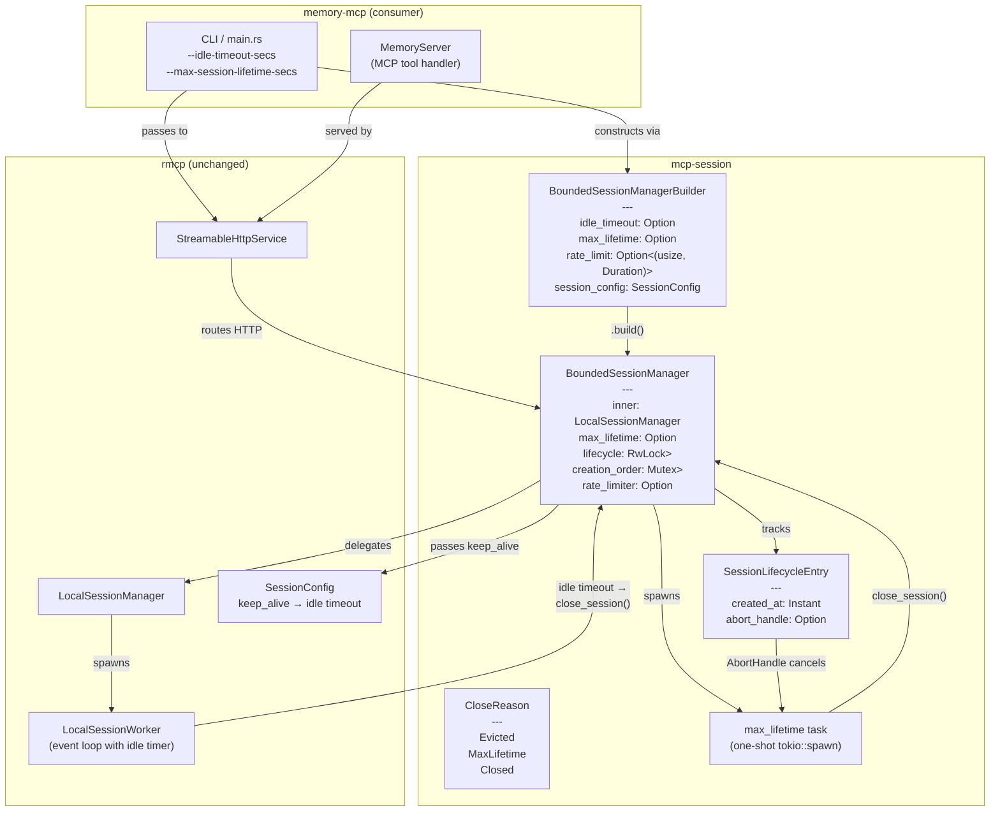
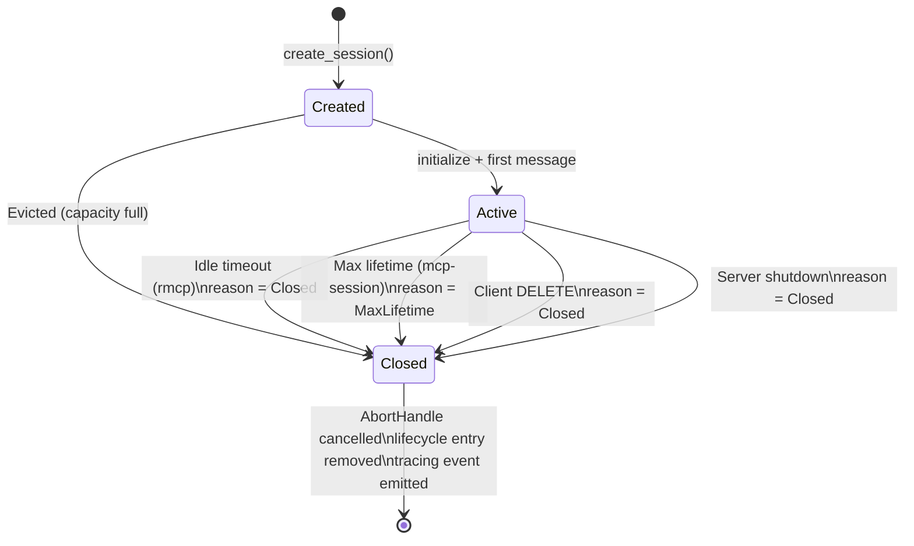
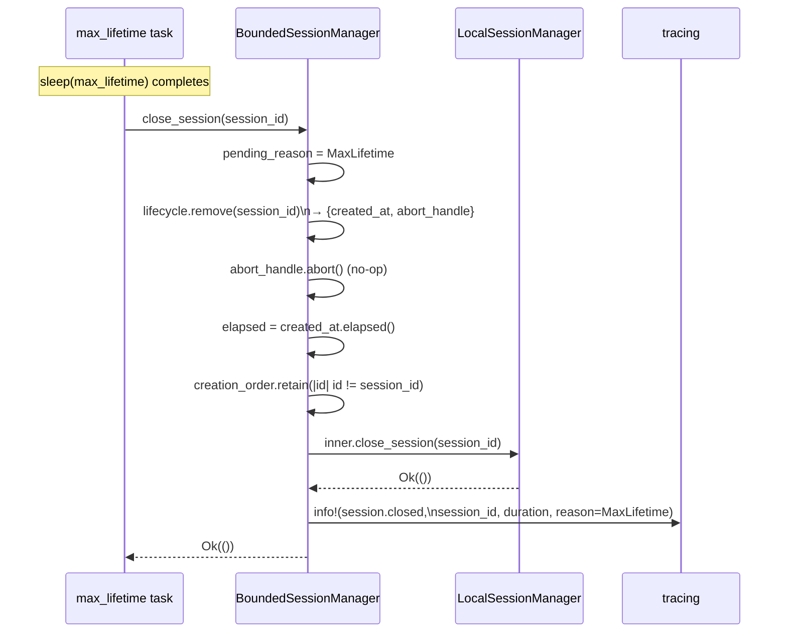
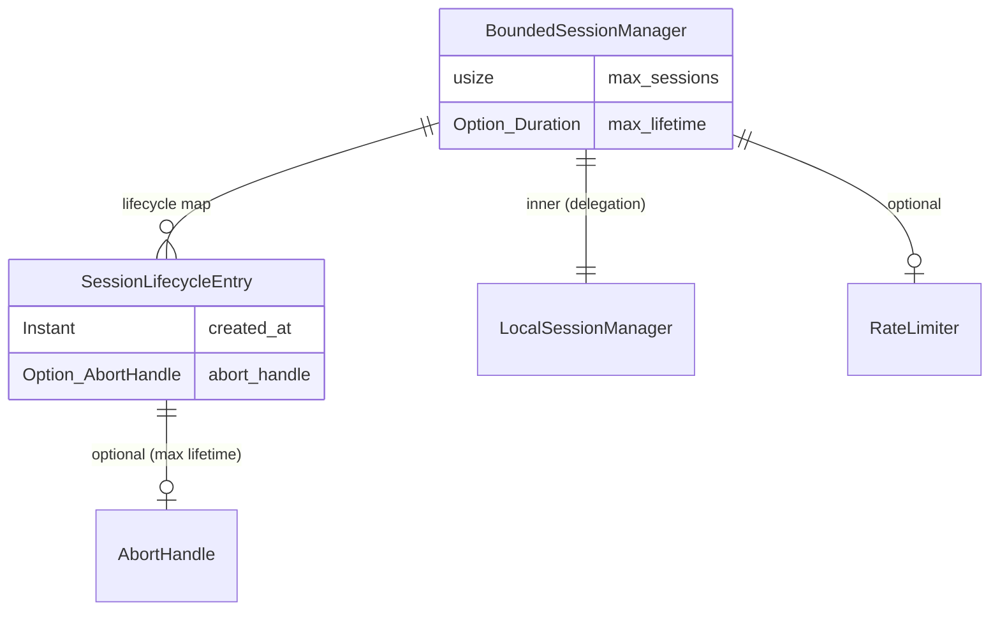

<!-- design-meta
status: approved
last-updated: 2026-05-14
phase: 3
-->

# Architecture: Session Lifecycle Observability (#114)

## Architectural Decisions

### D-01: Idle timeout delegates to rmcp

rmcp's `LocalSessionWorker::run()` already implements an idle timer via
`tokio::time::sleep()` at the top of each `select!` loop iteration. Any event
naturally resets it. This is the most performant and leak-proof approach — the
timer lives in the event loop with zero shared state.

mcp-session's builder exposes `.idle_timeout(Duration)` which sets
`SessionConfig::keep_alive` on the inner `LocalSessionManager`. No separate
timer, no reimplementation.

### D-02: Max lifetime is a one-shot per-session task

When max lifetime is configured, `create_session()` spawns a single
`tokio::spawn(async { sleep(max_lifetime).await; close_session(id) })`.
The task's `AbortHandle` is stored in `SessionLifecycleEntry` and cancelled
in `close_session()` if the session closes for any other reason.

One-shot tasks are the simplest construct that can't drift, can't leak (if
cancelled), and have zero per-message cost.

### D-03: Builder absorbs keep_alive to prevent two-knob conflict

`BoundedSessionManagerBuilder` owns the idle timeout configuration.
If `.idle_timeout()` is called, it sets `SessionConfig::keep_alive` to
that value. If a passthrough `SessionConfig` also has `keep_alive` set,
the builder overrides it with a `tracing::warn!`.

If `.idle_timeout()` is never called, the passthrough `SessionConfig::keep_alive`
flows through to rmcp unmodified. Existing consumers see no change.

### D-04: Close reason is best-effort

The `SessionManager` trait's `close_session(&SessionId)` carries no reason
parameter (it's rmcp's trait). mcp-session tracks close reasons via internal
state:

- **Evicted**: known — triggered by `create_session()` when capacity is full
- **MaxLifetime**: known — triggered by the one-shot task
- **Closed**: catch-all for idle timeout, client DELETE, server shutdown, and
  any other external `close_session()` call

To distinguish Evicted and MaxLifetime from external calls, the close path
checks a `pending_reason: Option<CloseReason>` set just before calling
`inner.close_session()`. The default is `Closed`.

### D-05: Per-session lifecycle tracking

`BoundedSessionManager` gains a `lifecycle: RwLock<HashMap<SessionId, SessionLifecycleEntry>>`
field. Each entry tracks `created_at: Instant` and `abort_handle: Option<AbortHandle>`.
This is separate from rmcp's internal session map.

The lifecycle map is updated in `create_session()` (insert) and
`close_session()` (remove + log). The existing `creation_order` deque is
retained for FIFO eviction ordering.

### D-06: Existing API preserved

`BoundedSessionManager::new(session_config, max_sessions)` and
`.with_rate_limit(count, window)` continue to work. The builder is an
alternative construction path that produces the same type. Internally,
the builder calls `new()` after preparing the `SessionConfig`.

## Component Diagram

mcp-session sits between memory-mcp (consumer) and rmcp (transport layer).
The builder constructs `BoundedSessionManager` with lifecycle tracking.
Idle timeout flows through to rmcp's event-loop timer; max lifetime is
managed by mcp-session via one-shot tasks.



## Session Lifecycle State Diagram

A session transitions through Created → Active → Closed. The Closed state
is terminal and is reached via four distinct paths, each carrying a
`CloseReason` for the tracing event.



## Sequence: Session Creation with Max Lifetime

When a session is created with max lifetime configured, `BoundedSessionManager`
delegates to rmcp for the actual session, then spawns a one-shot task and
records the lifecycle entry.

```mermaid
sequenceDiagram
    participant HTTP as StreamableHttpService
    participant BSM as BoundedSessionManager
    participant LSM as LocalSessionManager
    participant Task as max_lifetime task
    participant Log as tracing

    HTTP->>BSM: create_session()
    BSM->>BSM: rate_limiter.reserve()
    BSM->>BSM: check capacity, evict if needed
    BSM->>LSM: inner.create_session()
    LSM-->>BSM: (session_id, transport)

    BSM->>BSM: created_at = Instant::now()
    BSM->>Task: tokio::spawn(sleep(max_lifetime);\nclose_session(session_id))
    Task-->>BSM: abort_handle

    BSM->>BSM: lifecycle.insert(session_id,\n{created_at, abort_handle})
    BSM->>BSM: creation_order.push_back(session_id)
    BSM->>Log: info!(session.created, session_id)
    BSM-->>HTTP: (session_id, transport)
```

## Sequence: Max Lifetime Expiry

When the one-shot task fires, it calls `close_session()` with reason
`MaxLifetime`. The close path cancels any remaining abort handle (no-op
in this case), removes tracking state, delegates to rmcp for cleanup,
and emits the tracing event with session duration.



## Data Model



## Key Design Properties

**Performance**: zero per-message overhead from mcp-session. Idle timeout
is handled by rmcp's event loop. Max lifetime is a one-shot sleep. Lifecycle
tracking is two map operations (insert on create, remove on close).

**Leak prevention**: max lifetime tasks are cancelled via `AbortHandle` in
every `close_session()` call path. The lifecycle map and creation_order deque
are cleaned up in the same close path. No orphaned tasks or entries.

**Backward compatibility**: existing `new()` constructor works unchanged.
Builder is opt-in. No managed lifecycle tracking is created unless the
builder is used with `.idle_timeout()` or `.max_lifetime()`.
