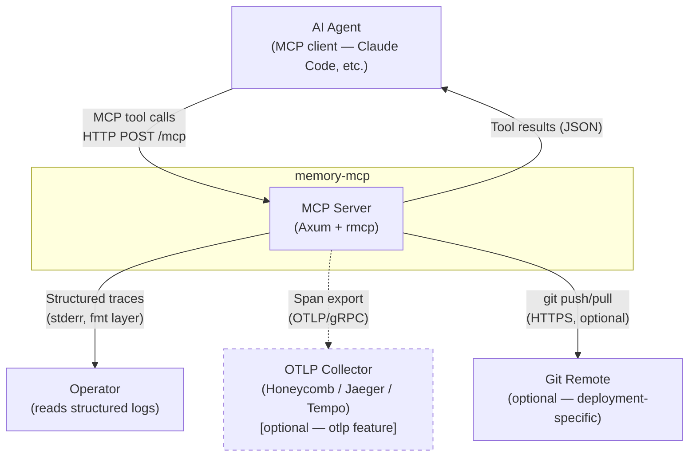
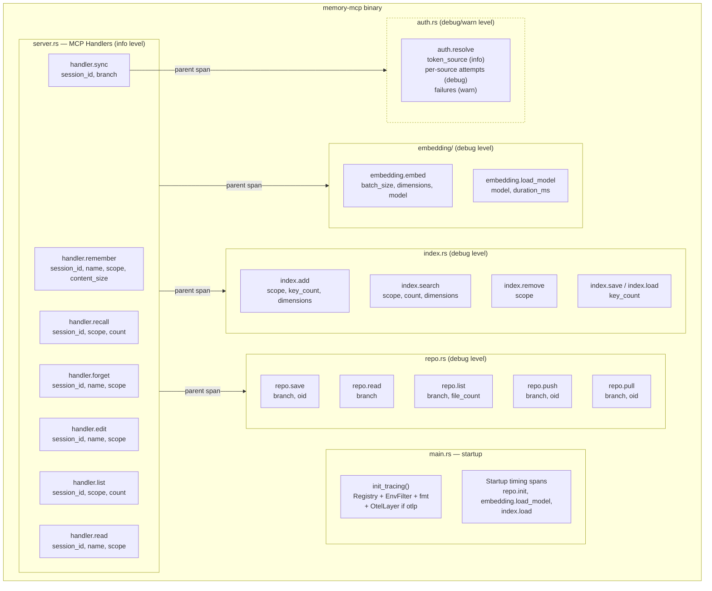
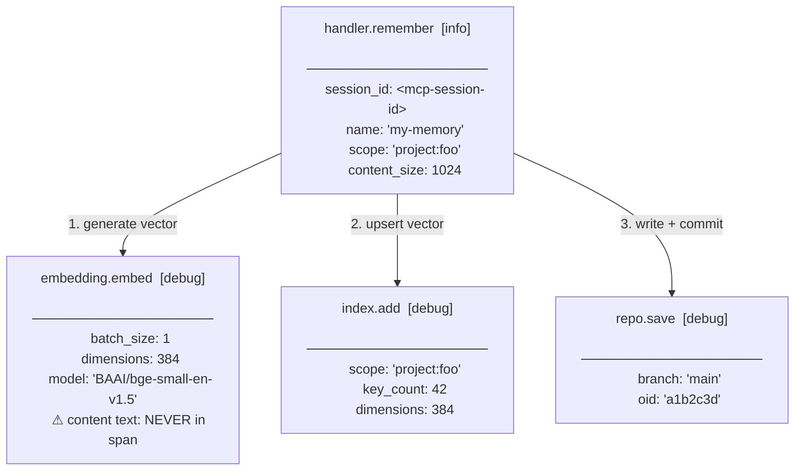
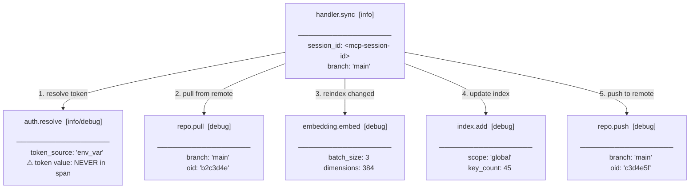
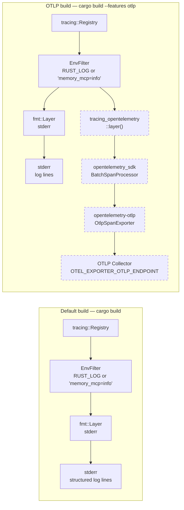

<!-- design-meta
status: draft
last-updated: 2026-04-23
phase: 3
-->

# Architecture: Tracing Scaffold (#52)

*Draft — 2026-04-23*

## Decisions

| # | Decision | Choice | Rationale |
|---|----------|--------|-----------|
| 1 | Subscriber composition | Two `#[cfg]` branches in `init_tracing()` — `fmt`-only (default) or `fmt` + OpenTelemetry layer (with `--features otlp`) | Avoids type system complexity of conditional layers; duplication is minimal |
| 2 | Span placement | `#[instrument]` for straightforward methods; manual spans for complex flows (auth resolution, pull/merge, handlers) | `#[instrument]` where params map to fields; manual where fields are computed mid-function |
| 3 | Span naming | `module.operation` everywhere — `handler.remember`, `embedding.embed`, `index.search`, `repo.push`, `auth.resolve` | Consistent, greppable, sorts well in trace UIs |
| 4 | Field naming | Flat `snake_case` — `batch_size`, `content_size`, `key_count`, `session_id` | Native to `tracing` crate; domain-specific fields don't need OTel dotted conventions |
| 5 | Session ID | Extract `http::request::Parts` via rmcp's `Extension` extractor, read `mcp-session-id` header | rmcp already injects HTTP parts into request extensions; no new plumbing needed |
| 6 | Sensitive data | Redact at source — tokens, content, credentials never enter span fields | Simpler and more secure than filtering layers; follows existing `redact_url` pattern |
| 7 | OTLP deps | `opentelemetry`, `opentelemetry_sdk`, `opentelemetry-otlp`, `tracing-opentelemetry` all optional behind `otlp` feature | Zero dep cost for default builds |
| 8 | OTLP endpoint | Standard `OTEL_EXPORTER_OTLP_ENDPOINT` env var (handled by OpenTelemetry SDK) | No custom config; follows OTel conventions. Compatible with Honeycomb, Jaeger, Tempo, etc. |
| 9 | Default levels | Handler spans at `info`, subsystem spans at `debug`, security events at `warn` | Operators get handler-level flow at defaults; `debug` for detail; security events always visible |

## Field Dictionary

Canonical field names used across all modules:

| Field | Type | Modules | Description |
|-------|------|---------|-------------|
| `session_id` | str | handlers | MCP session identifier (from `mcp-session-id` header) |
| `name` | str | handlers, repo | Memory name |
| `scope` | str | handlers, index | Scope value (`global`, `project:x`) |
| `content_size` | usize | handlers | Content size in bytes |
| `batch_size` | usize | embedding | Number of items in batch |
| `chunk_size` | usize | embedding | Items in current chunk |
| `dimensions` | usize | embedding, index | Vector dimensions |
| `model` | str | embedding | Model identifier |
| `count` | usize | index, handlers | Result/item count |
| `key_count` | usize | index | Keys in index |
| `branch` | str | repo | Git branch name |
| `file_count` | usize | repo | Files affected |
| `oid` | str | repo | Git object ID (short) |
| `token_source` | str | auth | Resolved token provenance |
| `duration_ms` | u64 | various | Timing (where not captured by span duration) |

## Design Tension: Audit Content vs. Privacy

### The tension

Both memory content and query text are valuable from an auditing perspective —
knowing what was stored and what was searched for enables security monitoring
(e.g. detecting attempts to recall credentials) and compliance. But both
could contain sensitive or private information that needs protection.

### Why this can't be fully resolved in the scaffold

The tracing scaffold is the operational observability layer: timing, flow,
counts, errors. It should be broadly accessible to operators for debugging
and alerting. Audit logging — who accessed what, with full content — is a
different concern with different access control requirements.

Collapsing both into a single trace output channel creates a conflict:
either the traces are too sensitive for broad operator access, or the
audit trail is too sparse for compliance.

### Decision for the scaffold

The scaffold defaults to the **safe choice**: sizes and counts, not content
or query text. Memory content → `content_size`. No `query` field on recall
spans.

This is explicitly **not a permanent decision** — it's a Phase 2 default
that Phase 5 (Audit Logging) will revisit.

### How Phase 5 should resolve this

The standard enterprise pattern is **tiered output** — separate channels
with different content and access controls:

- **Operational traces** (this scaffold): timing, counts, sizes, flow.
  Broadly accessible. Powers debugging and alerting.
- **Audit log** (Phase 5): who accessed what, full query text, memory
  names, content hashes or full content. Restricted access. Powers
  compliance and incident investigation.

Both can use the same `tracing` infrastructure — different subscribers or
different span fields routed to different sinks. A span can carry both a
`content_size` field (operational) and emit an audit event with the full
content (routed only to the audit channel).

The scaffold supports this by:
1. Using layered subscribers (already composing `fmt` + optional OTLP)
2. Manual spans with explicit field lists (trivial to add audit-specific fields)
3. Not hardcoding any assumption about what "trace output" means

See #110, #111, #112 for the specific Phase 5 issues that will implement
audit fields on top of this scaffold.

## Diagrams

### System Context

memory-mcp sits between three external actors: an AI agent sending MCP tool
calls over streamable HTTP, an operator consuming trace output, and an optional
OTLP collector receiving structured telemetry. Trace output always goes to
stderr (formatted logs); when the `otlp` feature is compiled in, spans are
also exported to a collector (Honeycomb, Jaeger, Tempo, etc.).

### Component Diagram

Internal components are organized around the MCP handler layer, which is the
entry point for every tool call. Spans flow down from handlers through
subsystems — each nested under the parent handler span. The tracing subscriber,
composed in `main.rs`, consumes all spans; it always includes `EnvFilter` +
`fmt`, and conditionally adds an OpenTelemetry layer when `otlp` is active.

### Span Hierarchy — `handler.remember`

Shows the full span nesting for a `remember` call, the tool that touches
the most subsystems. Each span is annotated with its structured fields.
Content text and tokens never appear in any span field (R-16–R-18). The
session ID propagates from the handler span to all children via tracing's
implicit span inheritance.

### Span Hierarchy — `handler.sync`

The `sync` tool involves auth (for git push/pull) and is the only handler
where `auth.resolve` appears in the span tree.

### Subscriber Composition

`init_tracing()` has two compile-time paths. The default build composes
`Registry` + `EnvFilter` + `fmt` layer writing to stderr. With `--features otlp`,
a `tracing-opentelemetry` layer bridges spans to the OpenTelemetry SDK, which
exports via OTLP to the configured collector. Both paths share identical
instrumentation in all subsystems; the difference is purely in what the
subscriber does with the spans.

